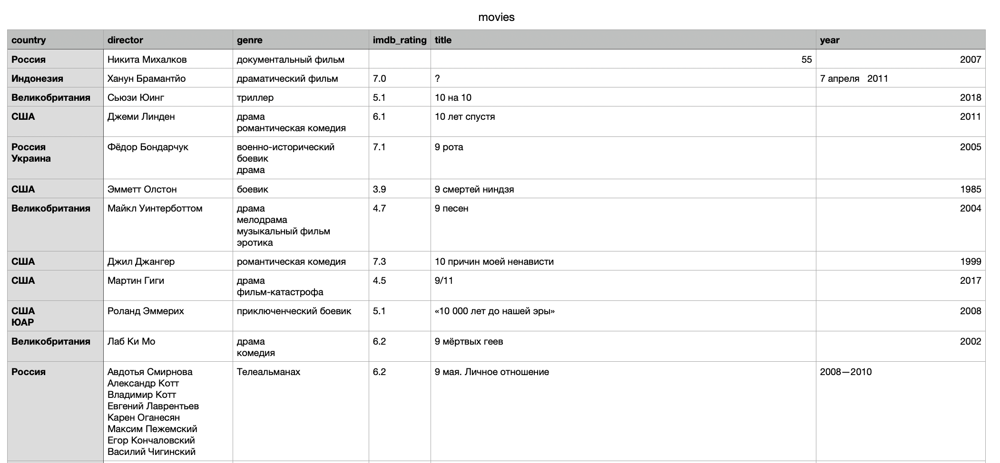

# movie_parser

Данный веб-скраппер предназначен для сбора и обработки данных о фильмах.

## Начало работы

Создание виртуального окружения:

```python -m venv venv```

Активация окружения:

```source venv/bin/activate```

Для запуска сбора данных:

```cd movie_parser```

```scrapy crawl wiki_movies```

Собранные данные сохраняются в файл в формате `csv`.

## Результат

